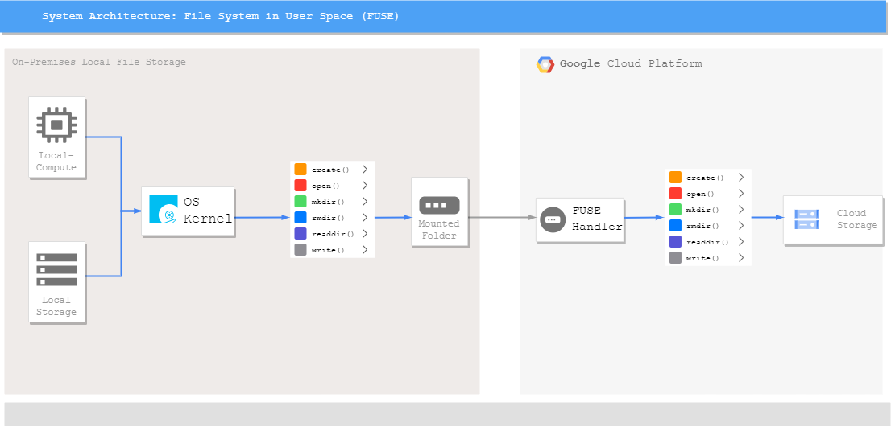

## FUSE: File system in user space using Google Cloud Storage

### Introduction.
This repository deals with designing, developing, and implementing a robust file system by mounting directory in the Virtual Machine and maintaining a cloud object storage. 

A file system in user space (Fuse) has been implemented to handle various file system calls and redirect the same to Google Cloud Storage buckets. 

All the basic file system calls, and directory calls have been handled while creating the file system. 

Docker containerization has also been implemented to scale this file system further in a distributed system. Benchmarking of I/O operations, bandwidth and latency have been included using FIO.

The original C implementation can be found at [3].

### Prerequisites.  
•	Install Google SDK in your local machine to access Google Cloud Platform.    
•	A Google Cloud account with active credits and projects are required.  
•	Clone this Repo.  
•	Create a VM Instance on Google Cloud (Included in the `VirtualMachineCreation.sh` bash script) and install requirements from the `installRequirements.sh`.  
•	Create a Bucket and Blob in Google Cloud Storage (Not included in the Bash script since I created it manually and did not get the equivalent CLI command).    
•	Mention respective bucket and blob details in the `configFile.py`.  

### Initial Setup and Instructions.
Once the Google account has been configured with active credits and project, we need to first create Virtual Machine Instances for Client and Server. We also need to create Virtual Private Cloud (VPC) network to be used by the VM and set the necessary firewall rules. The command line code to create the above are given in the `VirtualMachineCreation.sh` Bash Script. 

Once the VM’s have been created, we need to setup the Git, pip to install necessary python packages. All the necessary installation packages are mentioned in `requirements.txt`.

Additionally, I have also used Docker to containerize the whole file system and relevent requirements of docker are mentioned in `installRequirements.sh`.

### Files.
•	`FuseFS.py` – Contains the main FUSE code to handle the file system calls and accordingly maintain in Google Cloud Storage.
•	`configFile.py` – Contains the server configurations such as encoding format, bucket name, authentication JSON file name.
•	`Dockerfile` – Configuration for building the docker file into docker image.
•	`Fio_fuse_fs.fio` - Configuration for FIO benchmark testing.
•	`Local Folder` – local VM folder
•	`Mount Folder` – Mount Folder in which the Fuse will be mounted.

### Execution Instructions.
Ensure all the requirements are installed using the `installRequirements.sh` bash script inside the Google Compute Engine VM.  
Select a folder that needs to be mounted and another folder that is a local folder to test the system.

•	Execute `python3 FuseFS.py /local /mount` on terminal and now FUSE file system has been mounted on the mount folder.

Now any changes to the folder that has been mounted will reflect both in the local folder as well as Google Cloud Storage in the same format.

•	Create a file using command `touch test.txt` and file has been created on the bucket as well.
•	Write on the file using the command `echo “Hello Fuse” > test.txt` and the changes are reflected on the bucket as well.
•	Reading the data from the bucket using the command `cat test.txt`.
•	Make a directory using command `mkdir testfolder` and directory has been created on the bucket.
•	Remove this created directory using command `rmdir testfolder` and the same will be deleted from the bucket as well.
•	Unlink (delete) the file using command `unlink test.txt` and the file will be removed from the bucket.

### Docker Containerization.

The whole file system has been containerized in Docker by creating a Dockerfile – Docker Image – Docker Container. The docker container provides isolation and portability to any other Virtual Machine for effective scalability. Once the docker image has been created, it can be easily deployed over any machine.

### Docker Execution.
•	In a directory (In my case, `dockerfusefs`) include all the necessary files needed to install the libraries as well as scripts required to mount the file system into Google Cloud Storage Bucket.
•	Create a Dockerfile which contains the command to copy the python file, config file, requirement files into a temporary folder within the container.
•	Also include, scripts to run the necessary libraries of apt-get and pip.
•	Assign executable rights to the files that need to be executed and finally change the working directory as temp. Lastly, specify the command to run the fuse python script.
•	Once this docker file is ready, build the docker file using the command `docker build -t dockerfusefs`.
•	This creates the docker image of the docker file.
•	To create a container of this image, execute the command `docker run --privileged -d dockerfusefs`.
•	Now the docker container has been created and running. Details of the docker file can be found using the command `docker ps`.

To start the mount and perform operations we just need to run the below commands as we did initially.

•	**Performance Testing:** `docker exec -it a05760daf8a0 fio /tmp/fio_fuse_fs.fio`.
•	**Create File:** `docker exec -it a05760daf8a0 touch /tmp/mount/testDocker.txt`.
•	**Write File:** `docker exec -it a05760daf8a0 echo "Hello from Docker" > /tmp/mount/testDocker.txt`.

Note: `a05760daf8a0` is the docker container Id assigned corresponding to dockerfusefs. This id can be found using the command `docker ps` and has to be used to stop the container if need be.

Container can be stopped using command `docker stop a05760daf8a0`.

### Performance Analysis
Apart from the above-mentioned testing for correctness and accuracy of the standard POSIX interface I have also tested the file system for its bandwidth, **IOPS (Input/Output Operations Per Second)**, and **latency using Flexible IO Tester (FIO)**. Two types of testing patterns such as **Sequential Read/Write** and **Random Read/Write** are available in FIO for which the testing has been carried out.

Configure the `fio_fuse_fs.fio` file with the appropriate parameters.

The detail and definition of each parameter is defined in [1] and [2].  

I have chosen to include only a few for the sake of testing.

### FIO Execution
•	Execute the command `fio ./fio_fuse_fs.fio` which will basically start the testing as per the defined configuration.
•	Executing this gives us the summary statistics of the read and write operations in terms of **bandwidth (bw), IOPS (iops) and latency (lat)**.

The output of this performance testing is included in the `Performance-Testing-Output.txt` for reference.

### Conclusion  
•	Fuse File system has been implemented and mounted to Google Cloud Bucket with basic file storage operations as well as directory calls handled in the Fuse python scrips. •	•	Docker Containerization was also implemented for effective deployment and scalability.  

[1]:    https://forums.servethehome.com/index.php?threads/benchmarking-with-fio-and-generating-graphs.7665/ "Benchmarking with FIO"
[2]:	https://portal.nutanix.com/page/documents/kbs/details?targetId=kA07V000000LX7xSAG "FIO Parameters"
[3]:    https://github.com/libfuse/libfuse/blob/master/example/passthrough.c#L196 "libfuse"